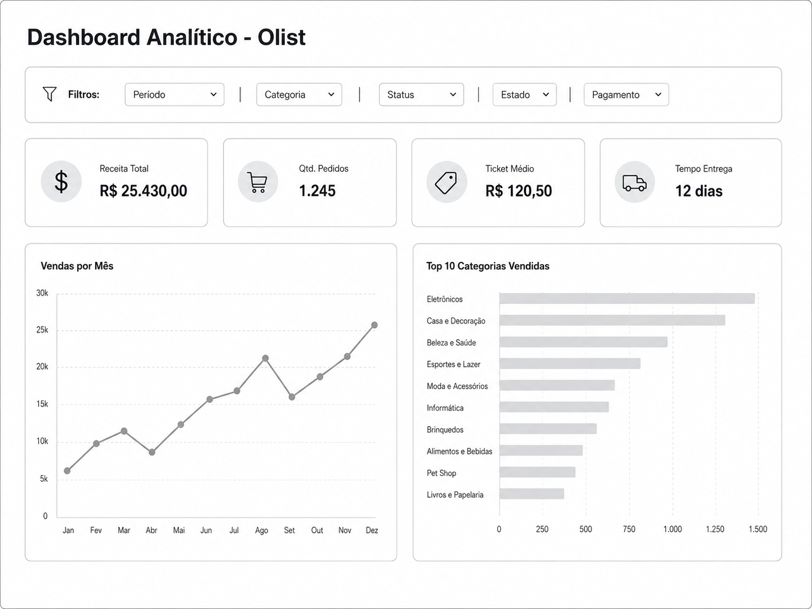

# Requisitos do Dashboard Analítico

## Objetivo

Desenvolver um dashboard analítico baseado no dataset público da Olist com foco na apresentação dos principais indicadores de desempenho do marketplace.

A proposta busca construir um painel simples, objetivo e visualmente organizado, permitindo que os usuários acompanhem os principais resultados do negócio sem excesso de informações.

---

# Dashboard Proposto

O dashboard será desenvolvido seguindo o conceito **One Page View**, concentrando todos os elementos principais em uma única tela.

A primeira versão será composta por:

* 4 KPIs principais;
* 2 gráficos analíticos;
* Filtros básicos de navegação.

O foco da solução é apresentar informações relevantes de forma clara e direta.

---

# Objetivos de Negócio

O dashboard deverá permitir o acompanhamento dos seguintes indicadores:

* Receita Total;
* Quantidade de Pedidos;
* Ticket Médio;
* Tempo Médio de Entrega;
* Evolução das Vendas;
* Categorias mais vendidas.

---

# Base de Dados

As informações utilizadas serão provenientes das seguintes tabelas do dataset Olist:

| Tabela                            |
| --------------------------------- |
| olist_orders_dataset              |
| olist_order_payments_dataset      |
| olist_order_items_dataset         |
| olist_products_dataset            |
| product_category_name_translation |
| olist_customers_dataset           |

Essas tabelas serão integradas na camada Gold do projeto para fornecer os dados necessários ao dashboard.

---

# Indicadores (KPIs)

## KPI 1 — Receita Total

Representa o valor total arrecadado com os pedidos.

### Fonte

* olist_order_payments_dataset

### Campo

* payment_value

### Cálculo

```text
Receita Total = SUM(payment_value)
```

### Exemplo

```text
R$ 25.430,00
```

---

## KPI 2 — Quantidade de Pedidos

Representa o total de pedidos realizados.

### Fonte

* olist_orders_dataset

### Campo

* order_id

### Cálculo

```text
COUNT(DISTINCT order_id)
```

### Exemplo

```text
1.245 pedidos
```

---

## KPI 3 — Ticket Médio

Representa o valor médio gasto por pedido.

### Fontes

* olist_order_payments_dataset
* olist_orders_dataset

### Cálculo

```text
Ticket Médio =
Receita Total / Quantidade de Pedidos
```

### Exemplo

```text
R$ 120,50
```

---

## KPI 4 — Tempo Médio de Entrega

Representa o tempo médio entre aprovação e entrega dos pedidos.

### Fonte

* olist_orders_dataset

### Campos

* order_approved_at
* order_delivered_customer_date

### Cálculo

```text
AVG(
order_delivered_customer_date
-
order_approved_at
)
```

### Exemplo

```text
12 dias
```

---

# Visualizações

## Gráfico 1 — Vendas por Mês

Apresenta a evolução das vendas ao longo do tempo.

### Métrica

* Receita Total

### Dimensão

* Mês
* Ano

### Visualização

* Gráfico de linha
* Gráfico de colunas

### Objetivo

Identificar tendências e sazonalidades nas vendas.

---

## Gráfico 2 — Top 10 Categorias Vendidas

Apresenta as categorias com maior volume de vendas.

### Métrica

* Quantidade vendida

### Dimensão

* Categoria do produto

### Visualização

* Gráfico de barras horizontais

### Objetivo

Identificar os segmentos com maior participação nas vendas.

---

# Filtros

O dashboard deverá disponibilizar filtros básicos para facilitar a análise dos dados.

## Filtros previstos

* Período;
* Categoria;
* Status do Pedido;
* Estado do Cliente;
* Tipo de Pagamento.

---

# Layout Proposto

O dashboard seguirá o modelo One Page View.

## Estrutura

```text
Cabeçalho
   ├── Título
   └── Filtros

KPIs
   ├── Receita Total
   ├── Quantidade de Pedidos
   ├── Ticket Médio
   └── Tempo Médio de Entrega

Gráficos
   ├── Vendas por Mês
   └── Top 10 Categorias Vendidas
```

---

## Esboço Inicial


---

# Requisitos Funcionais

## RF01 — Exibir Receita Total

O dashboard deve exibir a receita total considerando os filtros aplicados.

---

## RF02 — Exibir Quantidade de Pedidos

O dashboard deve exibir a quantidade total de pedidos.

---

## RF03 — Exibir Ticket Médio

O dashboard deve exibir o ticket médio dos pedidos.

---

## RF04 — Exibir Tempo Médio de Entrega

O dashboard deve exibir o tempo médio de entrega dos pedidos.

---

## RF05 — Exibir Vendas por Mês

O dashboard deve apresentar um gráfico contendo as vendas agrupadas por mês.

---

## RF06 — Exibir Top 10 Categorias Vendidas

O dashboard deve apresentar um gráfico contendo as dez categorias mais vendidas.

---

## RF07 — Permitir Aplicação de Filtros

O dashboard deve permitir a aplicação de filtros básicos aos KPIs e gráficos.

---

## RF08 — Atualizar Dados Conforme Filtros

Ao aplicar filtros, os KPIs e gráficos devem ser recalculados automaticamente.

---

# Observações

* O dashboard deverá ser simples e objetivo.
* Não serão incluídos gráficos adicionais na primeira versão.
* Os valores apresentados deverão ser provenientes da camada Gold.
* As métricas deverão estar alinhadas com as transformações implementadas no Data Warehouse.

---

# Pontos para Validação

Antes da implementação definitiva, deverão ser validados os seguintes aspectos:

* Tratamento de pedidos cancelados;
* Regra de cálculo do tempo médio de entrega;
* Critério de ordenação do Top 10 Categorias;
* Disponibilidade dos filtros na camada Gold;
* Conformidade com o padrão visual definido para a disciplina.

---

# Documento de Referência

- [requisitos_dashboard_analitico_olist.pdf](https://github.com/user-attachments/files/28807209/requisitos_dashboard_analitico_olist.pdf)
