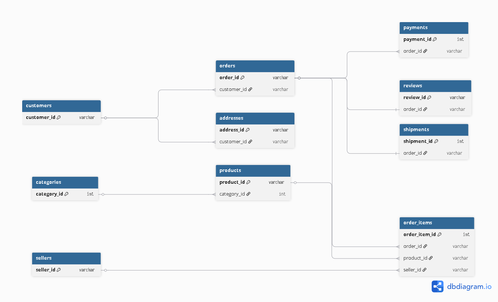

## DER Preliminar

O diagrama abaixo representa as principais entidades identificadas no domínio de negócio do projeto, bem como seus relacionamentos iniciais. O modelo foi elaborado com base na análise do dataset Olist e servirá como referência para as etapas de modelagem lógica e física do banco de dados.

**Observação:** Este modelo possui caráter preliminar e poderá sofrer ajustes durante as etapas de desenvolvimento, conforme a necessidade de adequação aos requisitos funcionais e analíticos do projeto.

### Principais Relacionamentos

* Um cliente pode realizar vários pedidos.
* Um cliente pode possuir um ou mais endereços.
* Um pedido pode conter um ou mais itens.
* Cada item de pedido está associado a um produto e a um vendedor.
* Um produto pertence a uma única categoria.
* Um pedido pode possuir um ou mais pagamentos.
* Um pedido pode receber uma avaliação após sua conclusão.
* Um pedido possui informações relacionadas ao processo de entrega.

### Finalidade

O DER preliminar tem como objetivo fornecer uma visão inicial da estrutura de dados do projeto, facilitando a compreensão das entidades de negócio e servindo como base para a implementação do banco transacional, do Data Lake e do modelo dimensional que será desenvolvido nas próximas etapas.

## Documento do dbdiagram.io

[DER - Preliminar.pdf](https://github.com/user-attachments/files/28690540/DER.-.Preliminar.pdf)