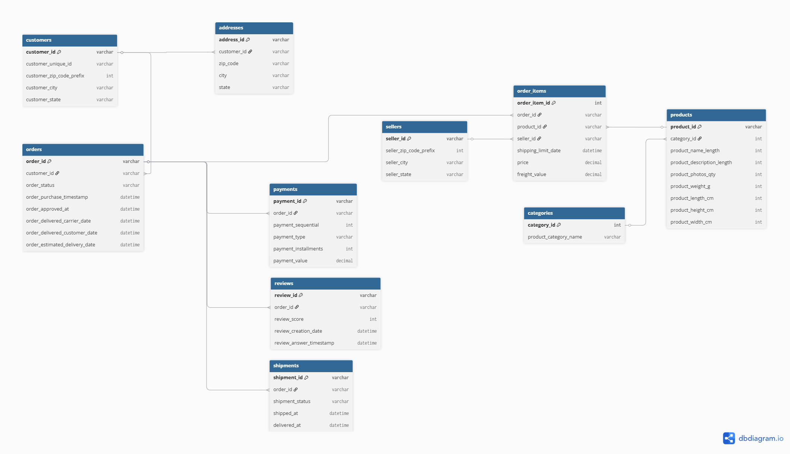
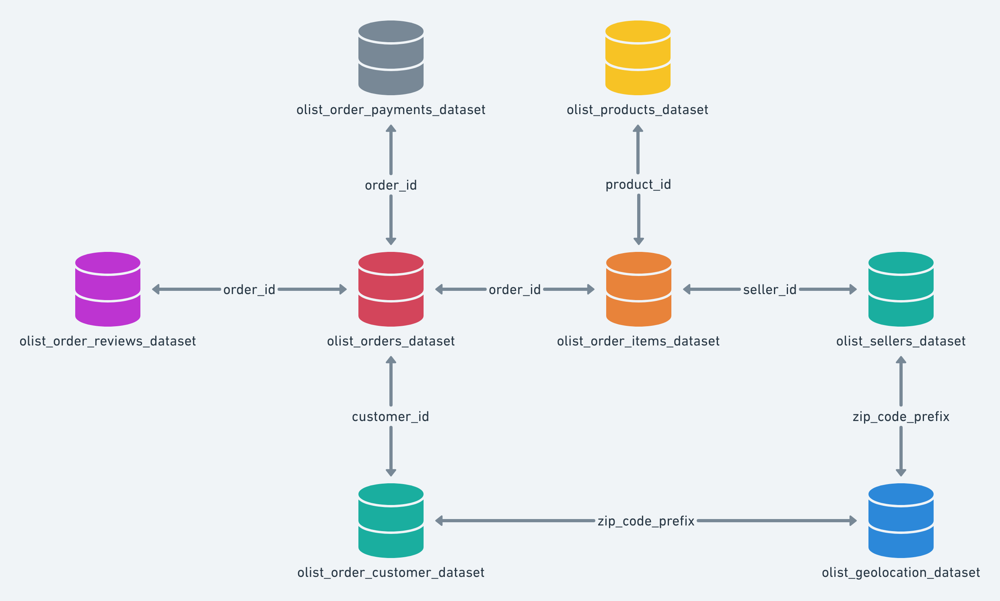

# Justificativa da Seleção de Atributos no DER Preliminar

## Contexto

Durante a evolução do DER preliminar para a versão lógica do modelo de dados, optou-se por não incluir todas as colunas disponíveis no dataset Olist.

A seleção dos atributos foi realizada com base nos objetivos do projeto, nas regras de negócio definidas e nos indicadores analíticos que serão construídos nas etapas posteriores do pipeline de dados.

O objetivo desta decisão foi manter o modelo mais legível, facilitar o entendimento do domínio e destacar apenas os atributos com relevância operacional e analítica.

---

## Diagrama

---

## O que foi decidido e abordado

### Customers

Foram mantidos os atributos relacionados à identificação e localização dos clientes.

**Justificativa:**

Essas informações poderão ser utilizadas futuramente em análises geográficas, segmentação de clientes e construção de dimensões analíticas.

---

### Orders

Foram mantidos os atributos relacionados ao ciclo de vida do pedido e às datas do processo de compra.

**Justificativa:**

Esses campos são fundamentais para cálculo de indicadores como quantidade de pedidos, análise temporal das vendas e tempo médio de entrega.

---

### Order Items

Foram mantidos os atributos relacionados aos produtos vendidos e aos valores financeiros.

**Justificativa:**

Esta entidade representa o detalhamento das vendas e servirá como uma das principais fontes para cálculo de receita, ticket médio e volume comercializado.

---

### Products

Foram mantidos atributos relacionados à categorização e características físicas dos produtos.

**Justificativa:**

Essas informações permitem análises por categoria de produto e poderão auxiliar em futuras análises logísticas.

---

### Categories

Foi mantido o identificador e o nome da categoria.

**Justificativa:**

Necessário para análises de desempenho por categoria e para a métrica de Top 10 Categorias Vendidas.

---

### Sellers

Foram mantidos os atributos de identificação e localização dos vendedores.

**Justificativa:**

Permitem análises futuras de desempenho por região e participação dos vendedores nas vendas.

---

### Payments

Foram mantidos os atributos relacionados ao método e valor do pagamento.

**Justificativa:**

Esses campos serão utilizados em análises financeiras e na validação dos indicadores de receita.

---

### Reviews

Foram mantidos os atributos relacionados à avaliação dos pedidos.

**Justificativa:**

Permitem futuras análises de satisfação dos clientes sem aumentar excessivamente a complexidade do modelo.

---

### Addresses

A entidade foi criada como complemento ao modelo transacional.

**Justificativa:**

Possibilita representar informações de localização dos clientes de forma organizada e alinhada às necessidades analíticas do projeto.

---

### Shipments

A entidade foi criada a partir dos dados de pedidos para representar o processo logístico.

**Justificativa:**

Sua inclusão facilita o entendimento do fluxo operacional e possibilita análises relacionadas ao processo de entrega.

## Documento do dbdiagram.io

[DER - Lógico.pdf](https://github.com/user-attachments/files/28707950/DER.-.Logico.pdf)

## Referência do Dataset Original

Durante a etapa de modelagem foi utilizada como referência a estrutura de relacionamentos disponibilizada pela Olist.

A partir dessa estrutura foi desenvolvido o DER Preliminar do projeto, adaptado às necessidades do domínio e aos objetivos analíticos definidos pela equipe.