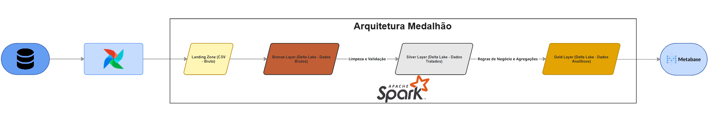
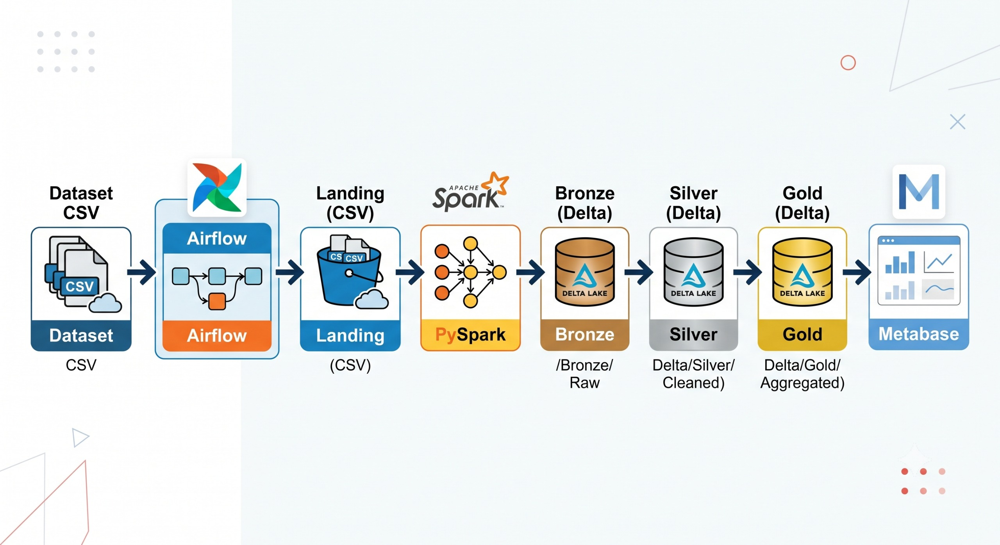

# Diagrama da Arquitetura de Dados

## Objetivo

Documentar visualmente a arquitetura de dados do projeto, demonstrando o fluxo das informações desde a origem dos dados até a camada de consumo analítico.

---

## Diagrama

### Diagrama elaborado no Miro

**Link para visualização do diagrama:**
https://miro.com/welcomeonboard/dkova28rS2FnazJoK0hwK1BvVnF3UWNZVTN3RGFQaW1KUHJ0VXlPNlU3UHMycG0xYzlYSjRxeXluSE56enJPSzVLUEUyckRqMHo0NXppcGw5SkxzVGhySWcyZjVjZlpKREMrRHJKaEhRaWxEY21NR0FxblVBZG4wN3M4U2N4a1FQdGo1ZEV3bUdPQWRZUHQzSGl6V2NBPT0hdjE=?share_link_id=925417688732

 **Fluxo dos Dados**

- **Dataset Olist (CSV)** – Fonte de dados utilizada no projeto.
- **Apache Airflow** – Responsável pela orquestração e execução do pipeline de dados.
- **Landing Zone** – Armazenamento inicial dos arquivos CSV em seu formato original.
- **Bronze Layer** – Ingestão dos dados utilizando Apache Spark (PySpark), armazenando os dados brutos em formato Delta Lake.
- **Silver Layer** – Aplicação de processos de limpeza, validação, padronização e integração dos dados.
- **Gold Layer** – Aplicação de regras de negócio, agregações e geração de métricas analíticas.
- **Metabase** – Consumo dos dados da camada Gold para construção de dashboards e relatórios.

### Diagrama elaborado por IA

---

## Arquitetura de Dados

O projeto adota a **Arquitetura Medalhão (Medallion Architecture)**, organizada em quatro camadas principais: **Landing, Bronze, Silver e Gold**.

O fluxo inicia com a ingestão dos arquivos CSV do dataset Olist. O processo é orquestrado pelo **Apache Airflow**, responsável pela execução e monitoramento das etapas do pipeline.

Os dados são inicialmente armazenados na **Landing Zone** em formato CSV, preservando sua estrutura original e garantindo rastreabilidade.

Em seguida, utilizando **Apache Spark (PySpark)**, os dados são convertidos para o formato **Delta Lake** e armazenados na camada **Bronze**, mantendo os registros brutos para futuras auditorias e reprocessamentos.

Na camada **Silver**, são realizadas atividades de limpeza, validação, padronização e integração dos dados, assegurando qualidade e consistência das informações.

A camada **Gold** contém os dados refinados e agregados de acordo com as necessidades analíticas do projeto, servindo como base para consultas, indicadores e análises de negócio.

Por fim, o consumo dos dados ocorre através do **Metabase**, conectado à camada Gold para geração de dashboards, relatórios e visualizações analíticas.

---
# Tecnologias Utilizadas

A arquitetura do projeto utiliza os seguintes componentes:

| Componente | Tecnologia |
|------------|------------|
| Origem dos Dados | Dataset Olist (CSV) |
| Orquestração | Apache Airflow |
| Processamento | Apache Spark (PySpark) |
| Armazenamento Landing | CSV |
| Armazenamento Bronze | Delta Lake |
| Armazenamento Silver | Delta Lake |
| Armazenamento Gold | Delta Lake |
| Visualização de Dados | Metabase |

## Resumo da Arquitetura

- **Origem dos Dados:** arquivos CSV do dataset Olist.
- **Orquestração:** Apache Airflow responsável pela execução e monitoramento do pipeline.
- **Processamento:** Apache Spark (PySpark) para ingestão, transformação e agregação dos dados.
- **Armazenamento:** arquitetura Medalhão utilizando CSV na Landing Zone e Delta Lake nas camadas Bronze, Silver e Gold.
- **Visualização:** Metabase para criação de dashboards e relatórios analíticos.
---
### Documento
- [Arquitetura de Dados.pdf](https://github.com/user-attachments/files/28799755/Arquitetura.de.Dados.pdf)
