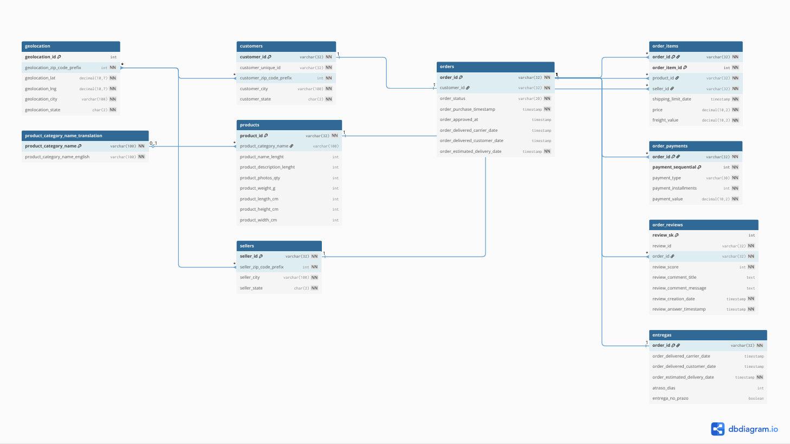

# Diagrama Entidade-Relacionamento (DER) Inicial

## Objetivo

Este documento apresenta o Diagrama Entidade-Relacionamento (DER) inicial elaborado a partir da análise do dataset público da Olist.

O modelo foi construído com base nas entidades identificadas durante o levantamento do domínio de negócio e servirá como referência para as próximas etapas de modelagem lógica e física.

---

# DER Inicial




# Documento

- [Dicionário de Dados Inicial — Olist](https://github.com/user-attachments/files/28782359/dicionario_dados_olist.pdf)
---

# Entidades Representadas

O modelo contempla as seguintes entidades:

* customers
* geolocation
* orders
* order_items
* order_payments
* order_reviews
* products
* sellers
* product_category_name_translation
* entregas

---

# Relacionamentos Identificados

## Customers → Orders

Um cliente pode realizar vários pedidos.

Relacionamento:

```text
1:N
```

---

## Orders → Order Items

Um pedido pode conter vários itens.

Relacionamento:

```text
1:N
```

---

## Orders → Payments

Um pedido pode possuir um ou mais pagamentos.

Relacionamento:

```text
1:N
```

---

## Orders → Reviews

Um pedido pode receber uma avaliação.

Relacionamento:

```text
1:1
```

---

## Orders → Entregas

Cada pedido possui informações relacionadas à entrega.

Relacionamento:

```text
1:1
```

---

## Products → Categories

Cada produto pertence a uma categoria.

Relacionamento:

```text
N:1
```

---

## Sellers → Order Items

Os vendedores estão associados aos itens vendidos.

Relacionamento:

```text
1:N
```

---

# Considerações de Modelagem

Alguns relacionamentos foram tratados como lógicos devido às características do dataset original.

### Geolocation

Relacionamento realizado através do prefixo de CEP.

### Categorias

Relacionamento opcional devido à existência de registros sem tradução ou sem categoria definida.

---

# Finalidade do DER

O DER inicial possui os seguintes objetivos:

* Facilitar o entendimento do domínio de negócio;
* Apoiar a modelagem lógica;
* Auxiliar a criação do banco transacional;
* Servir de base para a modelagem dimensional;
* Documentar a estrutura inicial do projeto.


